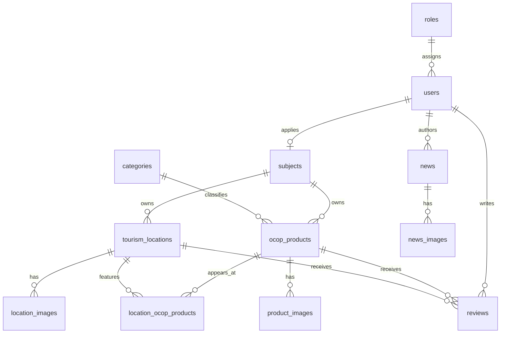

# ERD — Cổng thông tin OCOP Lâm Đồng

Các cột `geom` sử dụng `GEOMETRY(Point,4326)`. Bảng `reviews` bắt buộc đúng một trong
`product_id` hoặc `location_id`. Mỗi nhóm ảnh chỉ có tối đa một ảnh chính nhờ partial
unique index.

Hồ sơ `subjects` đồng thời là hồ sơ đăng ký chủ thể. Trường `status` biểu diễn
quy trình `pending → approved/rejected`; `moderation_note` lưu phản hồi của quản trị
viên khi xét duyệt.
