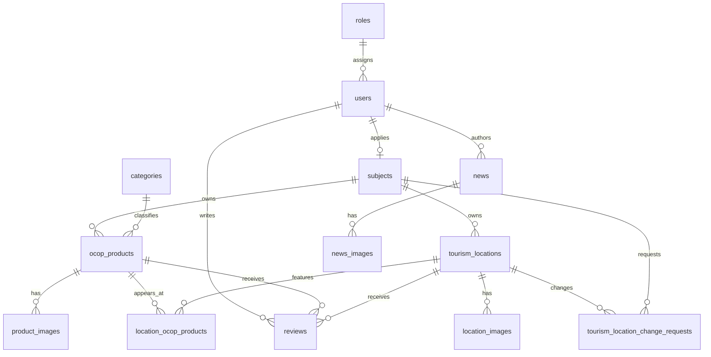

# ERD — Cổng thông tin OCOP Lâm Đồng

```mermaid
erDiagram
  roles ||--o{ users : assigns
  users ||--o| subjects : applies
  users ||--o{ reviews : writes
  users ||--o{ news : authors
  subjects ||--o{ ocop_products : owns
  subjects ||--o{ tourism_locations : owns
  categories ||--o{ ocop_products : classifies
  ocop_products ||--o{ product_images : has
  tourism_locations ||--o{ location_images : has
  ocop_products ||--o{ location_ocop_products : appears_at
  tourism_locations ||--o{ location_ocop_products : features
  ocop_products ||--o{ reviews : receives
  tourism_locations ||--o{ reviews : receives
  tourism_locations ||--o{ tourism_location_change_requests : changes
  subjects ||--o{ tourism_location_change_requests : requests
  news ||--o{ news_images : has
```

Các cột `geom` sử dụng `GEOMETRY(Point,4326)`. Bảng `reviews` bắt buộc đúng một trong
`product_id` hoặc `location_id`. Mỗi nhóm ảnh chỉ có tối đa một ảnh chính nhờ partial
unique index.

Hồ sơ `subjects` đồng thời là hồ sơ đăng ký chủ thể. Trường `status` biểu diễn
quy trình `pending → approved/rejected`; `reviewed_by`, `reviewed_at` và
`rejection_reason` lưu vết kiểm duyệt của quản trị viên.

Điểm du lịch `tourism_locations` (migration 009) dùng cùng quy trình kiểm duyệt với
sản phẩm: `draft → pending → needs_revision/approved/rejected`, lưu vết bằng
`submitted_at`, `reviewed_by`, `reviewed_at`, `review_note`. Cột `location_source`
cho biết vị trí lấy từ đâu (`admin_import` là dữ liệu nhóm nhập từ nguồn công khai;
`map_pin`, `device_gps`, `coordinates`, `google_maps_link` là chủ thể khai báo) và
`location_accuracy_m` lưu độ chính xác khi dùng GPS. Điểm đã duyệt chỉ được sửa hoặc
ngừng hiển thị qua `tourism_location_change_requests`: mỗi điểm có tối đa một yêu cầu
đang mở, điểm cũ vẫn hiển thị cho tới khi admin duyệt; `base_version` đối chiếu với
`tourism_locations.version` để phát hiện dữ liệu đã thay đổi.
